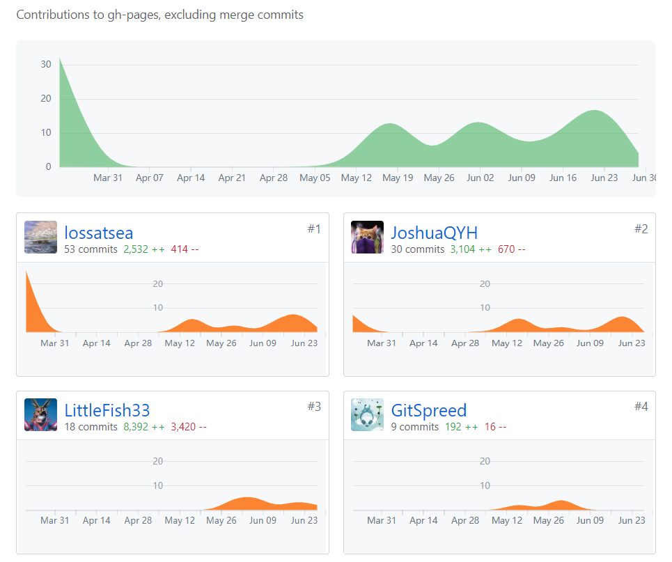
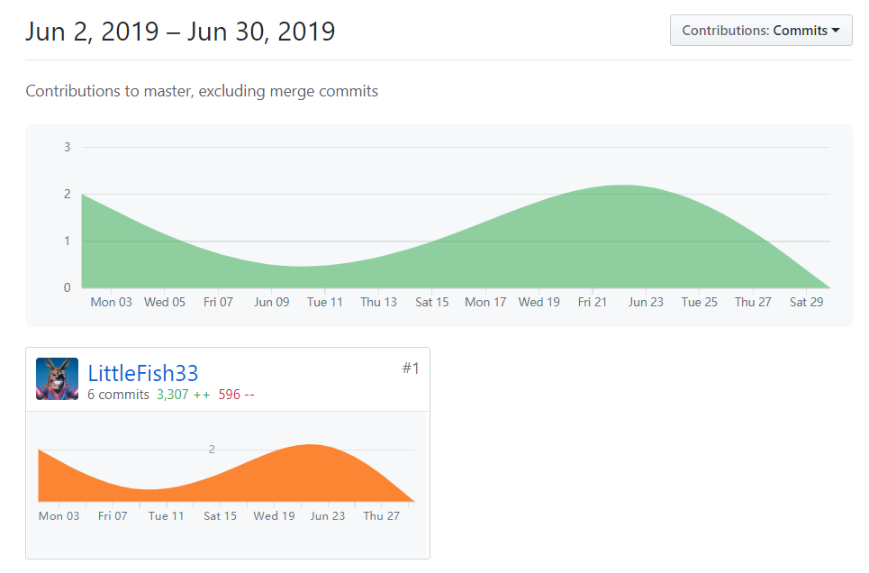

# 简短的课程学习自我总结

作为团队后端负责人和数据库负责人，我主要贡献在于：

- 确定后端接口需求
- 确定数据库设计需求
- 清晰的API文档
- 后端项目的远程部署

# PSP2.1 表

| PSP2.1                                | Personal Software Process Stages      | Time (%) Senior Student |
| ------------------------------------- | ------------------------------------- | ----------------------- |
| **Planning**                          | **计划**                              | 15                      |
| Estimate                              | 估计这个任务需要多少时间              | 15                      |
| **Development**                       | **开发**                              | 75                      |
| Analysis                              | 需求分析 (包括学习新技术)             | 8                       |
| Design Spec                           | 生成设计文档                          | 7                       |
| Design Review                         | 设计复审 (和同事审核设计文档)         | 5                       |
| Coding Standard                       | 代码规范 (为目前的开发制定合适的规范) | 5                       |
| Design                                | 具体设计                              | 10                      |
| Coding                                | 具体编码                              | 30                      |
| Code Review                           | 代码复审                              | 10                      |
| Test                                  | 测试（自我测试，修改代码，提交修改）  | 10                      |
| **Reporting**                         | **报告**                              | 10                      |
| Test Report                           | 测试报告                              | 0                       |
| Size Measurement                      | 计算工作量                            | 2                       |
| Postmortem & Process Improvement Plan | 事后总结, 并提出过程改进计划          | 8                       |

# 主要工作清单

* 数据库设计
  * 和小组成员讨论确定后台数据库需求
* 后台API设计
  * 和小组成员讨论确定后台数据库需求

* 后台API接口实现
  * 使用Go Iris 框架实现后台API

* API测试，后台部署
  * 将后台代码部署到云服务器
  * API接口测试
* API文档
  * 使用ApiPost工具写API接口文档

# 最有价值/最得意的工作

最有价值的工作是 **API 设计**，API的设计相当关键的一部分；一方面，前端代码的功能测试需要后台API接口的实现；另一方面，后台API的实现需要根据实际的需求确定，所以设计一个优秀的API对项目的实现至关重要，因此，API 设计是最有价值的工作；

# 最有苦劳的工作

最有苦劳的工作是API 接口的升级和维护；因为很难保证一开始确定的API接口之后不会再改变，因此即时升级和维护是必须的。一旦API发生变化，就可能对相关的调用者带来巨大的代价，用户需要排查所有调用的代码，需要调整所有与之相关的部分，这些工作对他们来说都是额外的。每次更改API之后，都需要重新现在本地进行测试，之后部署到云端，然后在测试云端的接口，在确定无误之后，最后书写/更新API接口文档。

# 个人博客列表

- 16340185-[Go iris 入门](https://blog.csdn.net/qiuxy23/article/details/93542162)
- 16340185-[在Go IRIS中使用JWT](https://blog.csdn.net/qiuxy23/article/details/93552125)
- 16340185-[在go中使用PostgreSQL](https://blog.csdn.net/qiuxy23/article/details/93555174)
- 16340185-[使用ApiPost来设计和管理API文档](https://blog.csdn.net/qiuxy23/article/details/93557746)
- 16340185-[Go Iris 实现认证与授权](https://blog.csdn.net/qiuxy23/article/details/93600846)

# 贡献记录

* 文档：

* 后端：

# 特别感谢

特别感谢有一群靠谱的队友，大家对项目整体进度把控很好，这次项目的完成，多亏了大家的互相配合！

