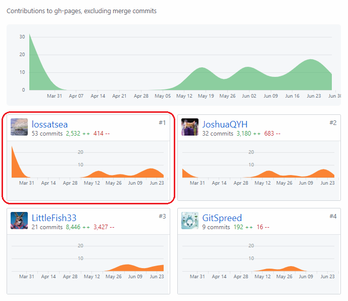
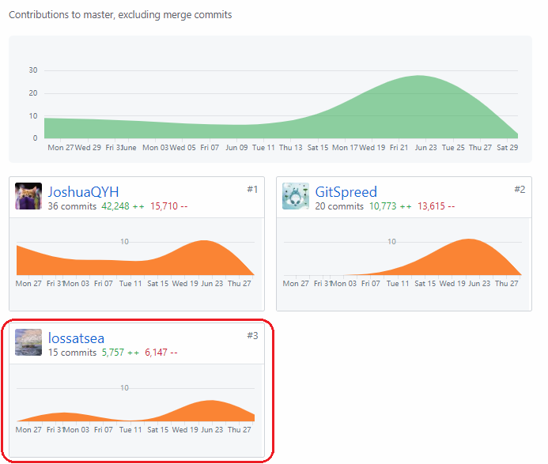

# 16340189 - 个人项目总结

github：lossatsea

昵称：Animania

### 个人简短小结

本次项目中在前期阶段参与需求分析和用例设计，参与讨论项目的大走向，在编程阶段负责与用户有关的方面，包括登录、注册、用户信息更新与编辑、退出登录功能。

### PSP 2.1 统计

| PSP2.1                                | Personal Software Process Stages      | Time (%) Senior Student |
| ------------------------------------- | ------------------------------------- | ----------------------- |
| **Planning**                          | **计划**                              | 10                      |
| Estimate                              | 估计这个任务需要多少时间              | 10                      |
| **Development**                       | **开发**                              | 80                      |
| Analysis                              | 需求分析 (包括学习新技术)             | 9                       |
| Design Spec                           | 生成设计文档                          | 9                       |
| Design Review                         | 设计复审 (和同事审核设计文档)         | 5                       |
| Coding Standard                       | 代码规范 (为目前的开发制定合适的规范) | 4                       |
| Design                                | 具体设计                              | 10                      |
| Coding                                | 具体编码                              | 35                      |
| Code Review                           | 代码复审                              | 7                       |
| Test                                  | 测试（自我测试，修改代码，提交修改）  | 11                      |
| **Reporting**                         | **报告**                              | 10                      |
| Test Report                           | 测试报告                              | 1                       |
| Size Measurement                      | 计算工作量                            | 2                       |
| Postmortem & Process Improvement Plan | 事后总结, 并提出过程改进计划          | 7                       |

### 主要工作清单

> 记录最得意/或有价值/或有苦劳的工作清单

- 确定采用localstorage来进行用户重要信息的记录（如token）
- 确定fetch与后台交互的流程（包括参数设置，响应处理）
- 复杂到超过600行的用户信息界面......

### 仓库贡献

#### 文档

#### 前端

> 最终成品中前端的代码贡献行数约为1.5k。

### 个人博客

- 16340189-[React中的props.history](https://blog.csdn.net/lossatsea/article/details/94069981)
- 16340189-[UI原型设计工具xiaopiu——事件和状态](https://blog.csdn.net/lossatsea/article/details/94079303)

### 特别致谢

特别致谢一人后台的littlefish33（虽然经常爆）。