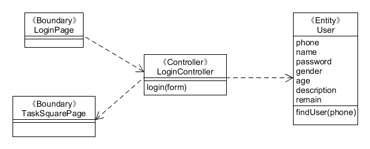
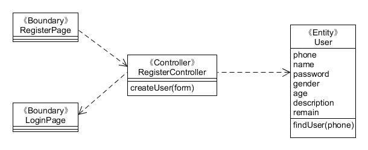
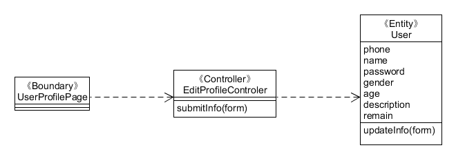

# 用例设计

### 登录

[详细用例](Usecase_and_Activity_Diagram.md#use-case-11-登录)

##### 顺序图

#### 类图

### 注册

[用例详情](Usecase_and_Activity_Diagram.md#use-case-21-注册)

#### 顺序图

#### 类图

### 编辑用户信息

在个人用户信息界面点击编辑按钮何以进行修改可改的用户信息，填写需要修改的用户信息，点击确定保存更改，点击取消不进行更改。

#### 顺序图

#### 类图

### 编辑问卷

[用例详情](Usecase_and_Activity_Diagram.md#use-case-12-奶牛任务管理新建修改删除)

#### 顺序图

### 提交问卷

#### 顺序图

[用例详情](Usecase_and_Activity_Diagram.md#use-case-23-完成任务)

### 管理问卷

[用例详情](Usecase_and_Activity_Diagram.md#use-case-12-奶牛任务管理新建修改删除)

#### 顺序图

----

#### 以上三个用例的类图

