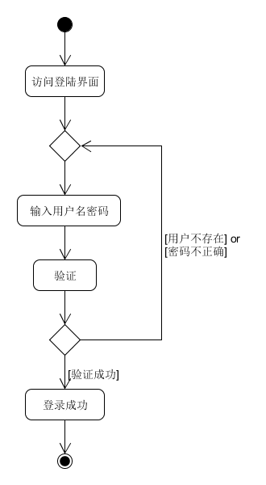

## 基本用例

#### Use case 1.1 登录

**范围：** 挣钱宝应用

**级别：** 子功能

**主要参与者：** 学生用户和“奶牛”用户

**涉众及其关注点：**

* 用户（学生或“奶牛”）：正确输入用户名和密码后可以正常登录系统，输入错误后有相应的提示，以便有效的检查和更改错误输入；在短时间内登录过系统后，不需要重复登录，以减少重复操作。
* 系统管理员：只有正确输入用户名和密码的用户才可以顺利的登录系统，以此来保证用户账户的安全；可能需要判断一些恶意的输入，防止一些恶意用户利用这里的输入入侵系统；对于短时间内登录过的用户，可以直接使其跳转主页，方便用户的使用，改善用户的使用体验。

**前置条件：**用户访问了本系统的登录界面。

**成功保证（或后置条件）：**得到正确的用户信息，经系统数据库确认后登录成功

**主成功场景（或基本流程）：**

1. 用户访问系统的登录界面
2. 要求用户输入用户名和密码
3. 系统验证用户名和密码的正确性
4. 用户信息正确则跳转主页
5. 用户信息输入错误则留在登录页面，并提示相关错误信息

**活动图**

**扩展（或替代流程）：**

用户短时间内登录过本系统，则可以免除输入用户信息 ，直接登录

1. 验证用户提供的cookie是否过期
2. 如果cookie合法且未过期，则直接跳转系统主页
3. 如果cookie不合法或者已经过期，则留在登录界面，请求用户输入相关信息

**特殊需求：**

* 支持多种语言
* 对于不同分辨率的显示支持

**技术与数据变元表：**

* 用户名与密码的输入可以是键盘输入，也可以是复制粘贴

**发生频率：**可能会不断地发生

**未决问题：**

* 针对恶意的脚本登录如何判别？
* 如果用户名和密码的输入中有恶意的代码，系统是否会被入侵？

#### Use case 1.2 奶牛任务管理（新建、修改、删除）

**范围：**挣钱宝应用

**级别：**用户目标

**主要参与者：**“奶牛”用户

**涉众及其关注点：**

* “奶牛”用户：可以方便快捷的管理自己的任务，对于一些常见的任务，可以快速的使用类似的模板生成。
* 系统管理员：用户能够正确的生成自己的任务，并将任务存储在服务器的数据库中。

**前置条件：**用户的角色必须是“奶牛”。

**成功保证（后置条件）：**正确存储用户已经创建的任务，对于已经用户已经存储的任务，可以正确的修改与删除。

**主成功场景（或基本流程）：**

1. “奶牛”用户进入任务管理界面，选择新建、修改或者删除已有任务。

   若用户选择**新建任务**，则

   * 跳转进入一个空的任务界面
   * 有一些子任务类型供用户选择
   * 用户选择完子任务的类型后，进一步输入任务的相应信息
   * 之后用户可以继续添加、修改或删除子任务，或者完成任务的创建
   
   

   若用户选择**修改已有任务**，则

   * 对于该任务中的子任务，用户可以修改其相应的信息
   * 用户可以继续新建子任务
   * 用户可以删除已有的子任务
   
   

   若用户选择**删除已有的任务**，则

   * 询问用户是否确认删除
   * 确认则删除任务，否则取消删除
   
   

2. 用户完成新建、修改或者删除操作后，跳转回任务管理界面，并更新相应的任务列表，同时更新服务器数据库

**扩展（或替代流程）：**

1. 用户误操作删除了任务：
   * 对于用户删除的任务，先放入回收站
   * 用户可以进入回收站恢复之前删除的任务
   * 回收站中的任务经过一定的时长会自动删除
2. 用户在新建或者修改任务时，想取消操作
   * 用户点击取消按钮，则当前操作取消
3. 用户在新建或者修改任务时，可以暂时保存
   * 用户点击保存按钮，任务的新建或者修改暂时保存

**技术与数据元变化表：**

3. 暂时保存任务可以是点击相应的保存按钮，也可以是通过快捷键保存。

**发生频率：**可能会不断地发生

**未决问题：**

* 用户点击完成提交新建的任务或者修改的任务时，万一网络连接断开该怎么办？
* 用户修改相应的任务并保存后，想取消修改，应该怎么办？

## 非正式用例

#### Use case 2.1 注册

**主成功场景：**用户登录注册页面，输入相关信息，验证无误后注册成功。

**交替场景：**

* 用户输入的用户名已存在，注册失败，提示用户用户名已存在
* 用户两次输入的密码不相同，注册失败，提示用户确认密码有误
* 用户未输入全部信息就点击注册按钮，注册失败，提示用户填写完整的注册信息

#### Use case 2.2 发布任务

**主成功场景：**“奶牛”用户选择要发布的任务，选择相关发布信息，如任务开始时间、任务结束时间、任务对象、任务奖励等，确认信息正确后，发布成功。

**交替场景：**

* 任务开始时间选择在当前时刻之间，提示用户任务开始时间已过，是否将任务开始时间修改为当前时刻并继续发布。
* 任务结束时间在开始时间之前、或在当前时刻之前，提示用户任务结束时间错误，请求重新输入。
* 点击发布按钮后，最后一次请求用户确认发布信息，确认则成功发布，否则返回发布界面重新修改信息。

#### Use case 2.3 完成任务

**主成功场景：**学生用户点击选择相应的任务后进入任务完成页面，在完成所有问题后，任务完成。

**交替场景：**

* 用户没有完成所有问题就点击提交按钮，提示用户未完成任务。
* 用户放弃任务，点击放弃按钮，任务结束。

## 简述用例

#### Use case 3.1 浏览所有任务

* Actor：用户
* Type：Primary
* Description：用户成功登录后跳转主页，主页上显示了当前时刻所有任务的列表，及各个任务的简要信息。
