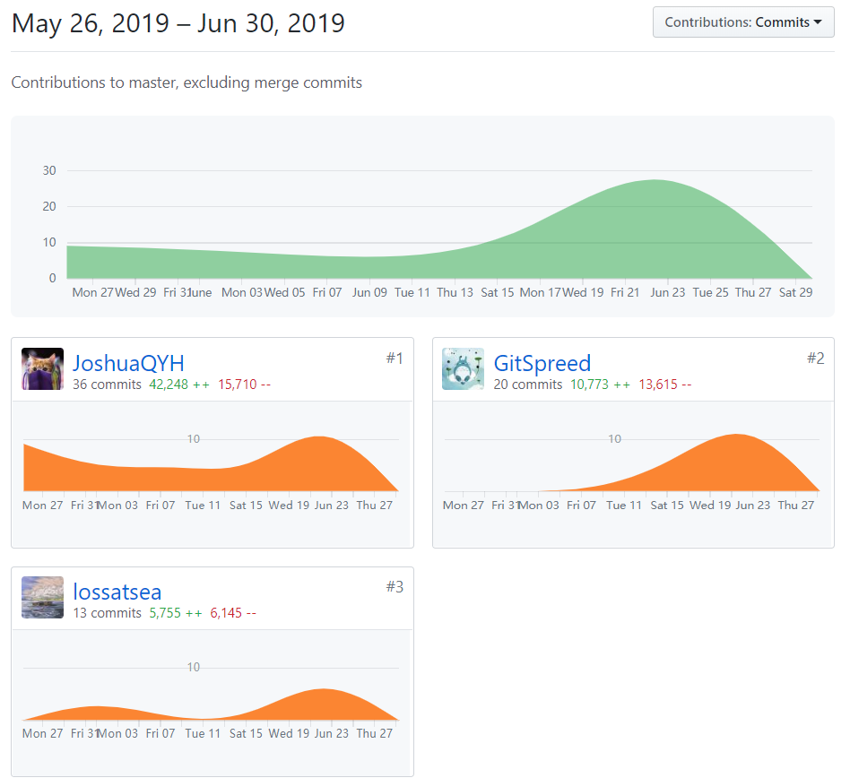
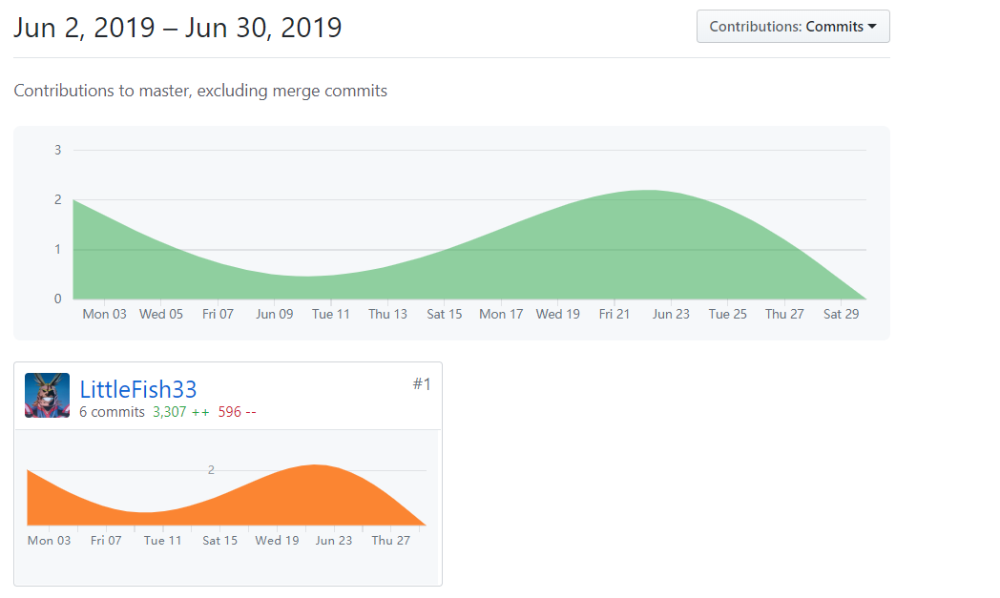

# 小组分工与贡献率

| 学号     | 昵称 | Github | 分工                                    | 贡献率 （合计100%） |
| -------- | ------ | --------------------------------------- | ------------------- | ------------------- |
| 16340186 |  | 邱奕浩 | 项目管理，需求分析，UI设计，前端开发    |  24%                 |
| 16340189 | Animania | [lossatsea](https://github.com/lossatsea) | 需求分析，UI设计，前端开发              | 23%                 |
| 16340185 | Batman | [LittleFish33](https://github.com/LittleFish33) | API接口设计，数据库设计，后端开发和部署 | 30%                 |
| 16340182 |  | 蒲其刚 | 需求分析，UI设计，前端开发，用例设计    | 23%                  |

# PSP 2.1 汇总

| PSP2.1                                | Personal Software Process Stages      |      | JoshuaQYH | lossatsea |      |
| ------------------------------------- | ------------------------------------- | ---- | --------- | --------- | ---- |
| **Planning**                          | **计划**                              |      | 15        | 10        |      |
| Estimate                              | 估计这个任务需要多少时间              |      | 15        | 10        |      |
| **Development**                       | **开发**                              |      | 75        | 80        |      |
| Analysis                              | 需求分析 (包括学习新技术)             |      | 10        | 9         |      |
| Design Spec                           | 生成设计文档                          |      | 7         | 9         |      |
| Design Review                         | 设计复审 (和同事审核设计文档)         |      | 5         | 5         |      |
| Coding Standard                       | 代码规范 (为目前的开发制定合适的规范) |      | 3         | 4         |      |
| Design                                | 具体设计                              |      | 10        | 10        |      |
| Coding                                | 具体编码                              |      | 30        | 35        |      |
| Code Review                           | 代码复审                              |      | 5         | 7         |      |
| Test                                  | 测试（自我测试，修改代码，提交修改）  |      | 5         | 11        |      |
| **Reporting**                         | **报告**                              |      | 10        | 10        |      |
| Test Report                           | 测试报告                              |      | 1         | 1         |      |
| Size Measurement                      | 计算工作量                            |      | 2         | 2         |      |
| Postmortem & Process Improvement Plan | 事后总结, 并提出过程改进计划          |      | 7         | 7         |      |

# 制品与贡献率

|          | 制品                       | 邱奕浩 | 蒲其刚 | lossatsea | 邱晓裕 |
| -------- | -------------------------- | ------ | ------ | ------ | ------ |
| 源码 | 后端所有模块               | -      | -      | -      | 100%   |
|          | ——以下是前端模块——     |        |        |        |        |
|          | 问卷管理模块               | 100%   | -      | -      | -      |
|          | 问卷列表预览访问模块       | 100%   | -      | -      | -      |
|          | 问卷回收站模块             | 100%   | -      | -      | -      |
|          | 问卷创建更新模块           | 100%   | -      | -      | -      |
|          | 问卷编辑模块               | 100%   | -      | -      | -      |
|          | 消息通知管理模块           | 100%   | -      | -      | -      |
|          | 登录模块                   | -      | -      | 100%   | -      |
|          | 注册模块                   | -      | -      | 100%   | -      |
|          | 用户信息（获取与编辑）模块 | -      | -      | 100%   | -      |
|          | 各页面的登录验证部分       | -      | -      | 100%   | -      |
|          | 问卷广场                  | -      | 100%      | -     | -    |
|          | 问卷详情                  | -       |100%      | -      | -    |
|          | 问卷提交模块              | -       | 100%      | -      | -   |
|          | 问卷搜索与筛选模块        | -        | 100%      | -     | -      |
|          | 问卷内容验证模块          | -        | 100%     | -     |-       |

> 前端代码模块分工说明：由于在一起开发过程中，难免会出现帮其他人修改模块的情况，但是模块改动面积普遍较小，这里就不指出修改的贡献率多少，一律按主要负责人贡献率为100%的规则处理。

|          | 制品           | 邱奕浩 | 蒲其刚 | lossatsea | 邱晓裕 |
| -------- | -------------- | ------ | ------ | ------ | ------ |
| **文档** | 需求规格说明书     | 10% | 80% | 10% | - |
|          | 软件设计文档       | 25%    | -      | 25%    | 50%    |
|          | 安装部署指南   | 50%    | -      | -      | 50%    |
|          | 用户使用手册   | -      | 100%   | -      | -      |
|          | 源代码目录 | -      | -      | 50%   | 50%      |

# Git Log 

* 前端代码

> @ Joshua QYH 注：由于前端部署工作由我完成，而在部署过程中，存在多次部署测试，所以后期的文件提交记录大部分是前端自动生成的文件，不能比较客观的反映个人的贡献，所以在这里稍微说明一下。

* 后端项目

* Dashboard

